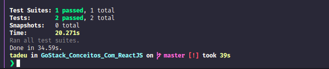

<h1 align="center">
  
</h1>

  

  
  
  

  

  <a href="https://github.com/TadeuA/GoStack_Conceitos_Com_ReactJS/blob/master/LICENSE.md">
    
  <a>

 

---

## 💻 Desafio

Desafio ReactJs nível 1: CRUD

- [x] Clone do template
- [x] Listar os repositorios com title
- [x] Adicionar um repositorio
  - [x] botão escrito "Adicionar"
  - [x] alterar o estado com a nova informação
- [x] Remover um repositorio
  - [x] botão escrito 'Remover"
  - [x] alterar o estado retirando a informaçã
- [x] Passar pelo teste de fogo

<h1 align="center">
  
</h1>

---

🔨 Built by [Tadeu Agostini](https://www.linkedin.com/in/tadeuagostini/)
